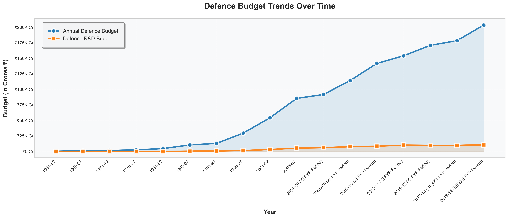
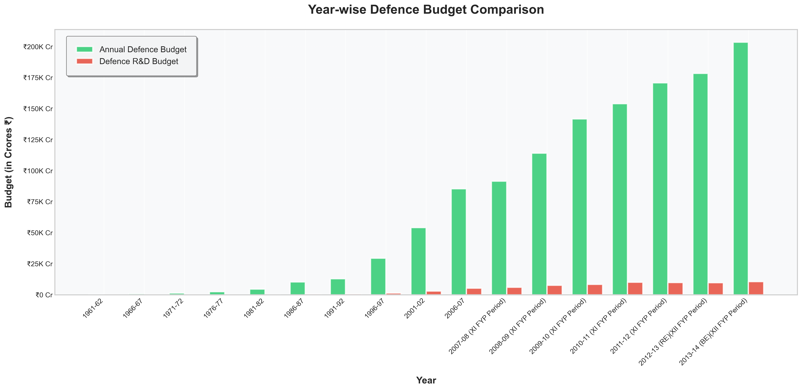
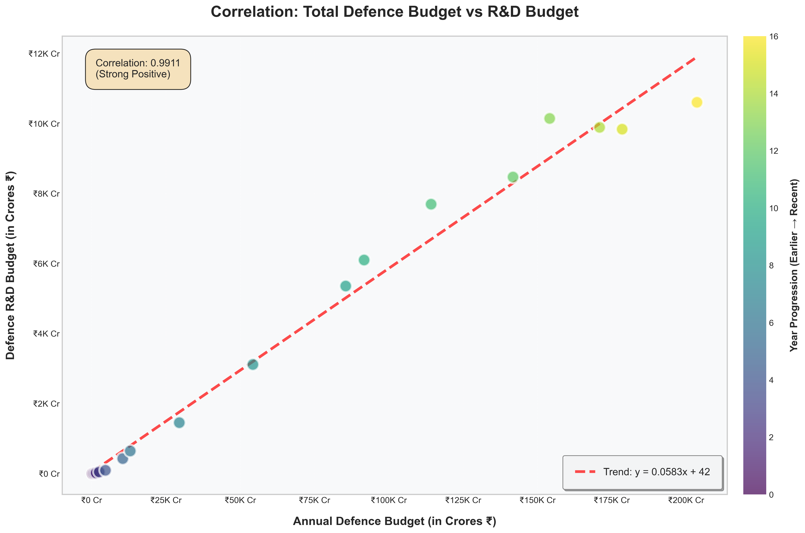
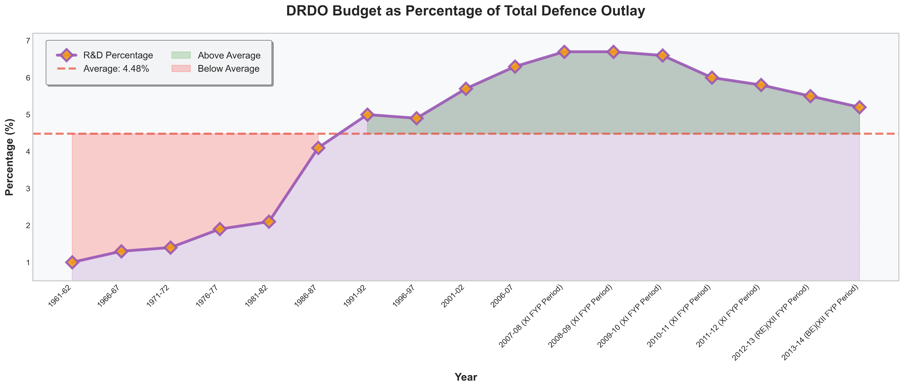

# Defence Budget Analysis Project

## Overview
This project performs comprehensive data analysis on India's Defence and R&D budget trends using data from [data.gov.in](https://data.gov.in/). The analysis visualizes budget allocations over time and finds key insights from historical trends.

## Dataset Source
**Dataset:** Department of Defence R&D Budget Over the Years  
**Source:** [data.gov.in](https://data.gov.in/)  
**File:** `Departofdefence_RandD_budgetover_1.csv`

The dataset contains historical data from 1961-62 to 2013-14 (BE), including:
- Annual Defence Budget (in Crores ₹)
- Defence R&D Budget (in Crores ₹)
- Percentage of DRDO Budget to Defence Outlay

## Project Structure
```defence-budget-analysis/
│
├── Defence_budget.ipynb                    # Main Jupyter notebook with analysis
├── Departofdefence_RandD_budgetover_1.csv  # Dataset file
├── README.md                               # Project documentation
│
└── Visualization/                                  
    ├── 1_line_plot.png                    # Line plot showing budget trends
    ├── 2_bar_plot.png                     # Bar plot comparing budgets year-wise
    ├── 3_scatter_plot.png                 # Scatter plot showing correlation
    └── 4_percentage_trend.png             # R&D percentage trend over time
```
## Visualizations Created

### 1. Line Plot - Defence Budget Trends Over Time


This dual-line visualization presents a comprehensive time-series analysis of India's defence spending patterns over five decades (1961-2013). The plot employs two distinct lines to track the parallel evolution of the total Annual Defence Budget and the specialized Defence R&D Budget allocation. The visualization effectively demonstrates the exponential growth trajectory of both budget categories, with the total defence budget experiencing a remarkable  increase from ₹313 Crores in 1961-62 to ₹203,672.1 Crores in 2013-14. The steepening curves in recent decades highlight the accelerated pace of defence modernization and the government's increasing commitment to military capabilities enhancement.

### 2. Bar Plot - Year-wise Budget Comparison


This side-by-side bar chart provides a detailed year-over-year comparison between the total Annual Defence Budget and the Defence R&D Budget allocations across the entire study period. The visualization employs contrasting colors to clearly distinguish between the two budget categories, making it easy to observe the magnitude difference between total defence spending and R&D-specific investments. The bar chart reveals consistent patterns where R&D allocations represent a smaller but significant portion of the overall defence budget throughout the timeline. Notable features include periods of accelerated growth in both categories, particularly visible in the post-2000 era, and the maintained proportional relationship between the two budget streams. This visualization effectively highlights specific years where budget increases were particularly pronounced, such as during periods of geopolitical tension or major defence modernization initiatives.

### 3. Scatter Plot - Correlation Analysis


This scatter plot with fitted trend line presents a sophisticated statistical analysis examining the relationship between Total Defence Budget and R&D Budget allocations. Each data point represents a specific fiscal year, plotting the R&D budget against the corresponding total defence budget to reveal underlying patterns in budget allocation strategies. The visualization includes a linear regression line that demonstrates the remarkably strong positive correlation coefficient of approximately 0.99, indicating an almost perfect linear relationship between the two variables. This near-perfect correlation suggests that R&D budget planning follows a systematic approach directly tied to overall defence spending levels, rather than being subject to arbitrary fluctuations. The tight clustering of data points around the trend line indicates consistent policy implementation and strategic budget planning that maintains R&D investment as a predictable percentage of total defence outlays.

### 4. Line Plot - R&D Percentage Trend


This specialized line plot analyzes the R&D budget as a percentage of total defence outlay over time, incorporating statistical elements including an average percentage line and color-coded shading to distinguish periods above and below the historical mean. The visualization reveals that R&D allocation percentages have fluctuated between approximately 1% and 6.7% of total defence spending, with notable peaks occurring during the 2007-2009 period when R&D investment reached its highest proportional levels. The plot includes visual indicators showing periods when R&D spending exceeded or fell below the historical average of 4.48%, providing insights into policy priorities during different governmental periods. Recent trends indicate a stabilization of R&D allocation around 5-6% of total defence budget, suggesting a matured approach to balancing immediate defence needs with long-term research and development investments for future military capabilities.

## Technologies Used
- **Python 3.12**
- **Libraries:**
  - `pandas` - Data manipulation and analysis
  - `numpy` - Numerical computations
  - `matplotlib` - Data visualization
  - `seaborn` - Statistical data visualization

## Key Findings

1. **Average Defence Budget Change:** ₹12,033 Crores/year
2. **Average R&D Budget Change:** ₹627 Crores/year
3. **Average Defence Growth Rate:** 22.85% per year
4. **Average R&D Growth Rate:** 25.12% per year
5. **R&D as % of Defence Budget (Average):** 4.48%
6. **Correlation (Defence vs R&D):** 0.9954 (Strong Positive)

## Observations

- **Exponential Growth:** Both defence and R&D budgets show consistent exponential growth over the 52-year period.
- **R&D Investment:** R&D budget as a percentage of total defence spending has fluctuated between 1% to 6.7%.
- **Recent Trends:** R&D percentage has stabilized around 5-6% in recent years after peaking in 2006-2010.
- **Strong Correlation:** The near-perfect correlation (0.9954) suggests R&D budget planning is closely tied to overall defence budget.
